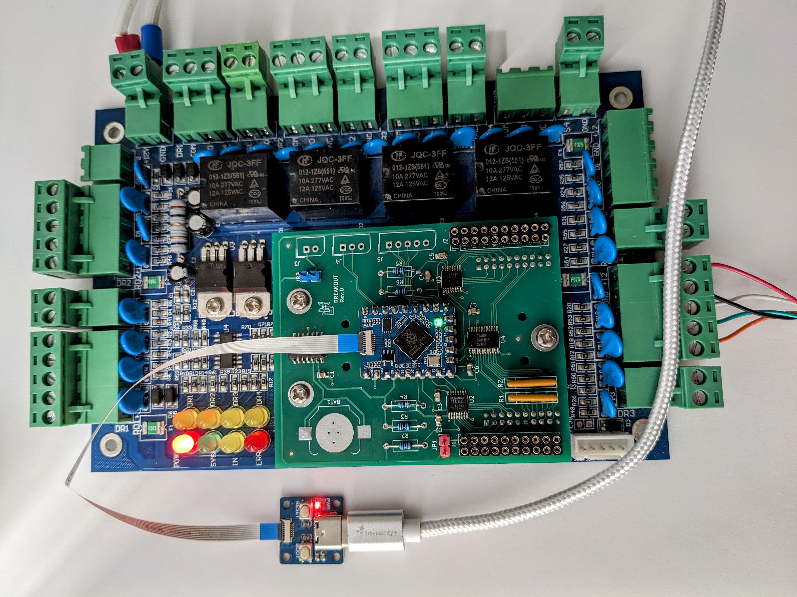
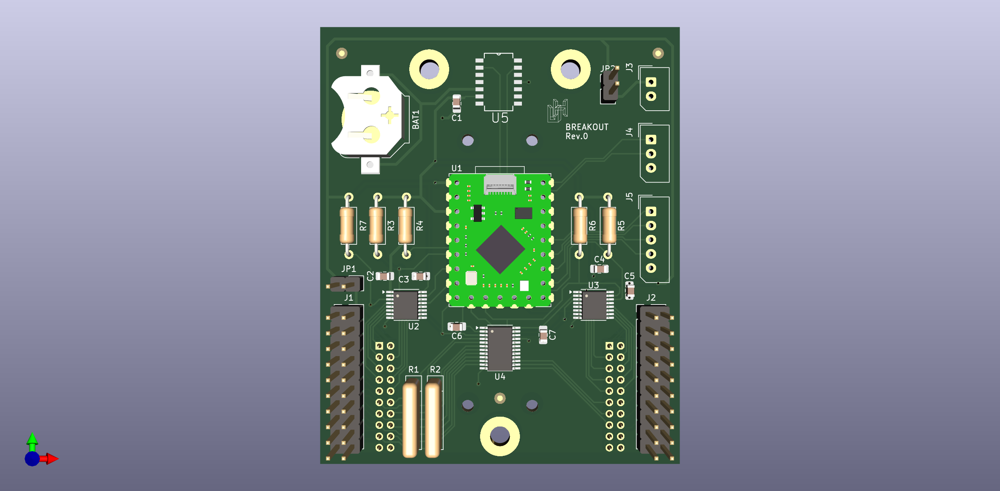
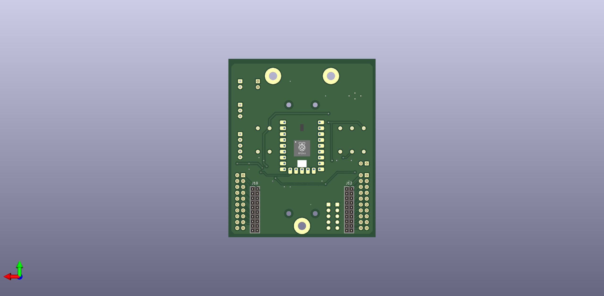

# uhppoted-breakout

Breakout board for the UHPPOTE TCP/IP Wiegand 26 access controllers. 

The breakout board substitutes the removable CPU board with a hackable board that:
- Exposes the interface connector pins as a pair of standard 2.54mm (0.1") headers
- Serialises card swipes and I/O events out to an SPI interface
- Has mounting holes for an external CPU to do the heavy lifting (e.g. _RaspberryPi_ _Zero2W_)
- Includes an onboard RTC

## Raison d'être

Mostly curiosity? But .. it also opens up the possibility of:
- IPv6
- TLS
- UDP multicast
- onboard WiFi
- interfacing with off brand readers and keypads
- custom access control requirements

## Roadmap

### Rev.0

**IN DEVELOPMENT**

Initial proof of concept, designed to be relatively easy to hand solder and debug:
- All the components are on the front (top) of the PCB
- It uses the ever-so-cute _WaveShare_ _RP2040-Tiny_ module
- Through-hole components where convenient

#### Errata
1. Requires Schottky barrier diode and resistor on RX8900SA backup battery.
2. Add-on mounting holes are for RaspberryPi Pico.

## Notes

### Footprints
1. The silkscreen footprint for J10 and J12 on the CPU board of the controller is either mirrored or
   using the footprint for a pin header (presumably because the pin and socket headers were swapped for
   easier assembly and the silkscreen was never updated).

2. The silkscreen footprint for J10 and J11 on the base board of the controller is either mirrored or
   using the footprint for a pin socket (presumably because the pin and socket headers were swapped for
   easier assembly and the silkscreen was never updated).

3. The breakout board uses the correct footprints for the J10 and J12 socket headers that connect the
   board to the base board.